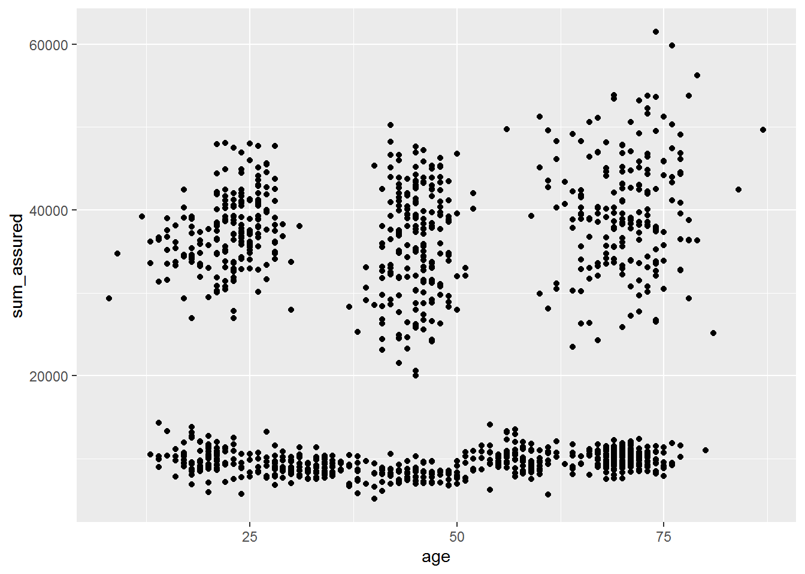
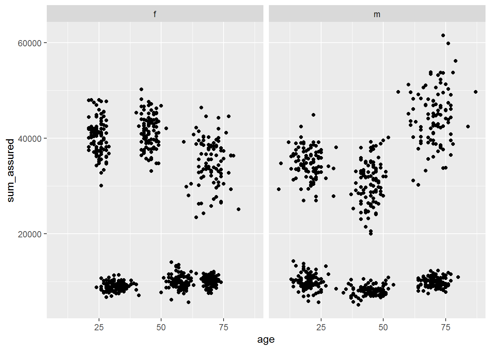
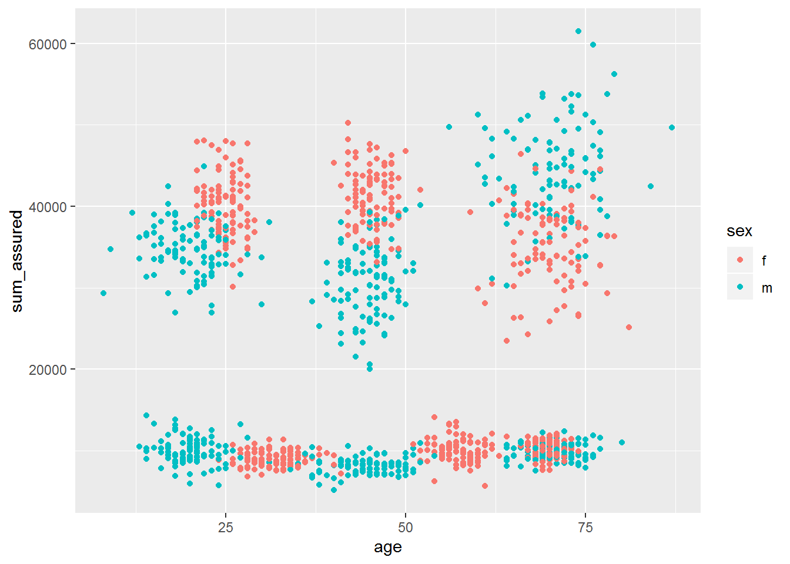
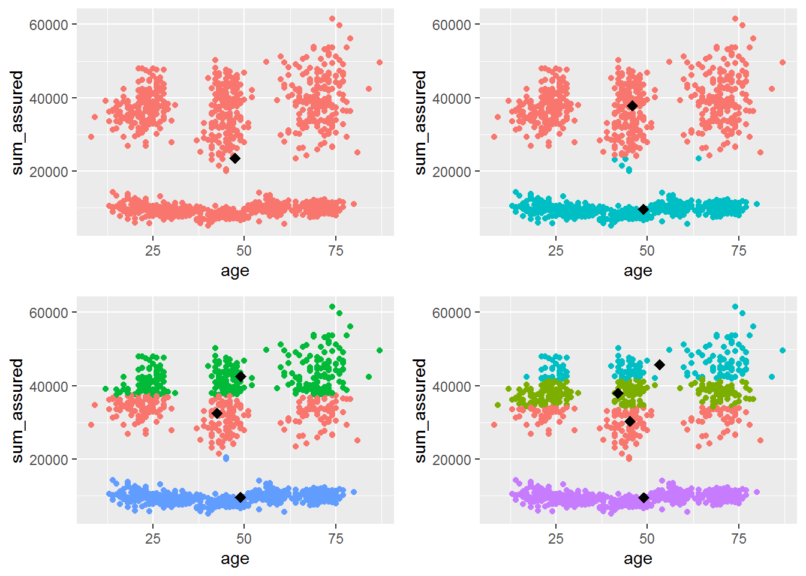

# Introduction
Still to fill

# General Settings
The pacman package is an R package management tool for loading and installing
packages if necessary. The following packages are used for the data generation: 
 
- **data.table:** For filtering, grouping and transforming the data as well
as fast read and write opterations. This package is particularly suitable for
the fast processing of large amounts of data. 
^[https://www.rdocumentation.org/packages/data.table/versions/1.12.2]
- **dplyr:** This package is a grammar of data manipulation, providing a consistent
set of verbs that help you solve the most common data manipulation challenges.
We need it especially for the use of the pipe operator.
^[https://www.rdocumentation.org/packages/dplyr/versions/0.7.8]
- **rmarkdown:** R Markdown provides an authoring framework for data science.
One can use a single R Markdown file to save and execute code and generate high
quality reports that can be shared with an audience.
^[https://www.rdocumentation.org/packages/rmarkdown/versions/1.14]
- **ggplot2:** ggplot2 is a system for declaratively creating graphics, based
on The Grammar of Graphics. 
^[https://www.rdocumentation.org/packages/ggplot2/versions/3.2.1]
- **gridExtra:** Provides a number of user-level functions to work with "grid"
graphics, notably to arrange multiple grid-based plots on a page, and draw tables.
^[https://www.rdocumentation.org/packages/gridExtra/versions/2.3]

We suppress the warning for the `pacman` library because the message that the 
package was built under a different R-versions should not bother the user by
beeing displayed on the console in red. Then the required packages are loaded
and installed if necessary. 


```r
suppressWarnings(if (!require("pacman")) install.packages("pacman"))
pacman::p_load(data.table, dplyr, rmarkdown, ggplot2, gridExtra)
```

For the analysis of the data functions are used which work with random numbers.
To make the results reproducible the random number generator is initialized 
with an arbitrary number (here 100) to ensure that the random numbers are the
same at every program run. 


```r
set.seed(100)
```

# Data preparation
The data is read in and a first check is performed to evaluate the structure 
of the data. It turns out that the data set contains 1200 observations with 4
variables each, namely sex, age, sum assured and ID. The variable ID is a 
consecutive number that uniquely identifies each contract. 


```r
raw_data <- fread("./data/insurance_portfolio.txt")
raw_data %>% str()
```

```
## Classes 'data.table' and 'data.frame':	1200 obs. of  4 variables:
##  $ sex        : chr  "m" "m" "m" "f" ...
##  $ age        : int  72 22 28 30 73 37 57 49 48 44 ...
##  $ sum_assured: int  43000 38601 11589 8962 8942 28284 10702 8335 43964 7414 ...
##  $ ID         : int  1 2 3 4 5 6 7 8 9 10 ...
##  - attr(*, ".internal.selfref")=<externalptr>
```

Since there can be only 2 different values for the variable sex, namely male 
and female, this variable is defined as a factor. 


```r
raw_data[, sex := as.factor(sex)]
```

A more detailed analysis of the input data using the `summary` function shows that:

1. The portfolio consists of 600 female and 600 male policyholders.

2. The age is between 8 and 87 years, which suggests that there are no 
implausible data points.

3. There are 10 policyholders whose age is indicated with NA. This indicates 
missing or incomplete data.

4. The sums insured are between 5119 and 61485. If one looks at the quantiles,
the minimum and maximum values, one can see that at first glance there are no
extreme outliers. Another good way to analyze the portfolio is the visual 
inspection that is performed in one of the next steps.


```r
raw_data %>% summary()
```

```
##  sex          age         sum_assured          ID        
##  f:600   Min.   : 8.00   Min.   : 5119   Min.   :   1.0  
##  m:600   1st Qu.:28.00   1st Qu.: 9498   1st Qu.: 300.8  
##          Median :46.00   Median :17183   Median : 600.5  
##          Mean   :47.42   Mean   :23625   Mean   : 600.5  
##          3rd Qu.:68.00   3rd Qu.:37735   3rd Qu.: 900.2  
##          Max.   :87.00   Max.   :61485   Max.   :1200.0  
##          NA's   :10
```

As already stated, there are 10 data points that have no values for age. These
10 data points will be removed for further analysis in order to work with a
cleaned dataset. 


```r
clean_data <- raw_data[!is.na(age),]
```

## Visual inspection
After a first overview of the data has already been given, the visual inspection
is carried out. For this purpose, the sum insured is plotted against age in a
point plot. The previous assumption that there are no outliers can be confirmed 
visually and new knowledge about the data structure can be gained. A total of
4 different clusters can be identified as seen in the plot below. 

 - A cluster shows policies with a sum insured of about 10.000 and ages in the
  entire range of  observations. 
  
 - Another cluster are those policies that have an insurance sum of approximately
  30.000 to 50.000 and an age of approximately 22. 
  
 - The next cluster covers policies with an sum insured in the range of 20.000 
  up to 50.000 and an age of 40 to 50.
  
 - The last cluster is a little more inhomogeneous than the others in terms of 
  both age and sum insured. It covers ages from 60 to 80 and sums insured from
  25.000 to 60.000.


```r
ggplot(data = clean_data, aes(x = age, y = sum_assured)) + geom_point()
```

<!-- --> 

In the previous plot, all data points were viewed in a single graph. In the 
next step a point plot is created, separated into men and women. It is important
to note that the scaling of the two plots is the same. It becomes apparent that
there are now 6 clusters for both men and women. The single cluster with
an insured sum of approximately 10000 is now divided into 3 different age groups. 


```r
ggplot(data = clean_data, aes(x = age, y = sum_assured)) +
  geom_point() +
  facet_grid(cols = vars(sex))
```

<!-- --> 

The same information can also be obtained by coloring the data points according
to their sex with men displayed in blue and women in red.


```r
ggplot(data = clean_data, aes(x = age, y = sum_assured, color = sex)) +
  geom_point()
```

<!-- --> 

# K-means
Processing and summarizing large amounts of data to find hidden patterns is a 
topic of interest in many different areas. K means is a suitable algorithm that 
divides the data set into a previously known number of $k$ groups. The aim is of 
course to find an optimal partition which need to be further defined. The data
set must be divided into $k$ partitions so that the sum of the squared deviations
from the cluster centers to all data points assigned to the corresponding cluster
is minimal. Mathematically, this corresponds to the optimization of a distance 
function: 

Given a set of $n$ observations $(\textbf{x}_1, \textbf{x}_2, ..., \textbf{x}_n)$
with $\textbf{x}_i \in \mathbb{R}^k$, the $k$-means algorithm partitions the $n$
observations into $k \leq n$ sets $C = \{C_1, C_2, ..., C_k\}$ such that 
^[https://en.wikipedia.org/wiki/K-means_clustering]
 $$\underset{C}{arg~min}\sum_{j=1}^k\sum_{x \in C_j}\lVert \textbf{x} - {\mu}_j \rVert^2$$
 
The K-means algorithm is already implemented by default and can be called using
the function `kmeans`. In a first step, the algorithm is applied to the unscaled 
values for the age and the sum insured, without distinguishing between the sexes.
The number of clusters is successively increased from 1 to 4 and the results
are displayed graphically. All data points belonging to the same cluster are
displayed in the same color and the cluster centers are indicated by black diamonds.
Since K-means randomly selects the cluster centers in the first step, the
algorithm is executed 50 times `nstart = 50L` and the best partitioning is selected. 


```r
lPlots <- lapply(1:4, function(k) {
  k_resut <- kmeans(clean_data[, .(age, sum_assured)],
                    k,
                    nstart = 50L,
                    iter.max = 100L)
  plot_centers <- k_resut$centers %>% as.data.table()
  ggplot() +
    geom_point(
      data = clean_data,
      aes(
        x = age,
        y = sum_assured,
        color = as.factor(k_resut$cluster)
      ),
      show.legend = FALSE
    ) +
    geom_point(
      data = plot_centers,
      aes(x = age, y = sum_assured),
      size = 3L,  # filled diamonds
      shape = 18L 
    )
})
```

After all results have been generated, they are arranged in a single plot.
It is obvious that the algorithm does not seem to be able to recognize the 4 
existing clusters correctly. It is rather noticeable that the data set is
divided into horizontal slices and apparently no consideration is given to
the different age structures. Also a further increase of the number of clusters
does not bring any improvement but leads to a more granular horizontal clustering
of the data set. 


```r
do.call("grid.arrange", c(lPlots, ncol = 2))
```

<!-- --> 

A hint why clustering did not work as desired is given by the form of the cluster.
Those should be circular, but in this case they are strongly elliptical. As 
defined above, the algorithm minimizes the quadratic deviations. The age in the
data set has a value range from 8 to 87 and the sum assured has a value range
from 5119 to 61485. Therefore, it is not surprising that the algorithm tries 
to find clusters that have a very similar sum insured, since deviations in this
dimension are strongly reflected in the minimization function. One way to solve
this problem is to scale the input data. 


---
title: "k-means.r"
author: "Desktop"
date: "2019-08-17"
---
